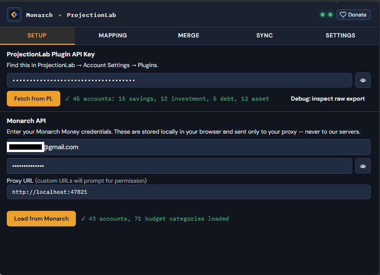

# Monarch → ProjectionLab Bridge

A Chrome extension that syncs account balances and budget data from [Monarch Money](https://monarchmoney.com) into [ProjectionLab](https://projectionlab.com) — keeping your financial projections current without manual entry.

<p align="center">
  
</p>

---

## Why?

Monarch Money is great at tracking what you **have** and what you **spend**. ProjectionLab is great at projecting where you're **headed**. This extension bridges the two — pull real account balances and spending data from Monarch and push them into ProjectionLab's plans, so your projections always start from reality and stay there.

---

## Features

### Account Mapping
Connect each Monarch account to a ProjectionLab account. Use **Auto-map by name** for one-click fuzzy matching, or pick manually from a dropdown grouped by account type. Don't see a match? Create new PL accounts right from the dropdown — individually or in bulk with **Create all unmapped**.

<p align="center">
  
</p>

### Budget Mapping
Map Monarch budget categories to ProjectionLab plan expenses. Choose whether to sync your **budgeted** (planned) amounts or **actual** historical spending with configurable lookback windows and averaging — override the source per category or per group.

<p align="center">
  
</p>

### Merges
Combine multiple Monarch accounts or budget categories into a single ProjectionLab entry. Roll all your checking + savings into one "Cash" balance, map a mortgage balance with a zillow value into one Home asset in PL, or group related spending like "Diapers", "Child Care", and "Baby Sitting" into a single "Childcare" expense — then apply it across any combination of plans.

<p align="center">
  
</p>

### Sync Preview
Before anything is written, review every value that will be pushed. Account items show the mapped balance; budget items show the converted amount at the target frequency. One click to push it all to ProjectionLab.

<p align="center">
  
</p>

---

## Two Ways to Run

### Option 1 — Self-Hosted (free, runs locally)

Run a lightweight Python proxy on your own machine. Your Monarch credentials stay local and are sent only to Monarch's API — never to any third-party server.

<p align="center">
  
</p>

### Option 2 — Hosted (no setup required)

Sign in with a Monarch Bridge account and let the hosted service handle Monarch data fetching for you. No local server, no Docker, no Python — just install the extension and go.

<p align="center">
  
</p>

---

## Self-Hosted Setup

### Prerequisites

- [Docker Desktop](https://www.docker.com/products/docker-desktop/) (recommended), **or** Python 3.11+
- Google Chrome (or any Chromium-based browser, I'm a BIG fan of Vivaldi if you're looking for unsolicited suggestions)

### Docker (recommended)

1. Clone this repo or download the `Monarch API/` folder.

2. Start the proxy:
   ```bash
   cd "Monarch API"
   docker compose up -d
   ```
   The API will be available at `http://localhost:47821`.

3. Enter your Monarch credentials in the extension's **Setup** tab — they're sent from the extension to your local proxy via request headers. Nothing is stored on disk.

### Manual (Python)

1. Create and activate a virtual environment:
   ```bash
   python -m venv venv
   source venv/bin/activate   # Windows: venv\Scripts\activate
   ```

2. Install dependencies:
   ```bash
   pip install -r "Monarch API/requirements.txt"
   ```

3. Run the proxy:
   ```bash
   uvicorn monarch:app --host 127.0.0.1 --port 47821 --app-dir "Monarch API"
   ```

4. Enter your Monarch credentials in the extension's **Setup** tab — they're sent from the extension to your local proxy via request headers. Nothing is stored on disk.

---

## Extension Installation

1. Open Chrome and navigate to `chrome://extensions`
2. Enable **Developer mode** (toggle in the top-right corner)
3. Click **Load unpacked** and select the `monarch-extension/` folder
4. Pin the extension to your toolbar for easy access

---

## Getting Started

### 1 — Connect ProjectionLab

Open the extension popup and go to the **Setup** tab. Click **Fetch from PL** while you have [ProjectionLab](https://app.projectionlab.com) open — this retrieves your Plugin API key and loads all your PL accounts and expenses.

### 2 — Connect Monarch

**Self-hosted:** Enter your Monarch credentials and proxy URL, then click **Load from Monarch**.

**Hosted:** Click the **Account** button in the header, sign in, then click **Load from Monarch**.

### 3 — Map your accounts

Go to **Mapping → Accounts**. Use **Auto-map by name** for a head start, then fine-tune. Accounts without a PL match can be created inline or bulk-created with **Create all unmapped**.

### 4 — Map your budgets

Go to **Mapping → Budgets**. Connect each Monarch category to a PL plan expense, choose which plans to apply it to, and pick the expense frequency. Select **Actual** as the source to use real spending data instead of budgeted amounts.

### 5 — Set up merges (optional)

Go to the **Merge** tab to combine multiple Monarch accounts or budget categories into single PL entries. Great for simplifying your projection model without losing granularity in Monarch.

### 6 — Sync

Go to the **Sync** tab, review the preview, and click **Push to ProjectionLab**. Done.

---

## MFA / Two-Factor Authentication

If your Monarch account uses TOTP-based two-factor authentication, you can provide the base32 secret key in **Settings → Monarch Authentication**. When enabled, the extension generates TOTP codes automatically — no manual entry of 6-digit codes on every session refresh.

---

## Hosted Version

The hosted version eliminates the need for a local proxy. Sign up for a Monarch Bridge account, and the extension routes data through a secure backend:

- Monarch credentials are sent directly to Monarch's API from your browser — never stored on our servers
- Session tokens are stored for up to 10 minutes to complete MFA flows
- An active subscription is required (manage billing from the Account dropdown)

---

## Support Development

If you're using the self-hosted version and find this extension useful, consider donating via the **Donate** button in the extension header.

---

## Contributing

Pull requests are welcome. Please open an issue first for significant changes.

## License

MIT
